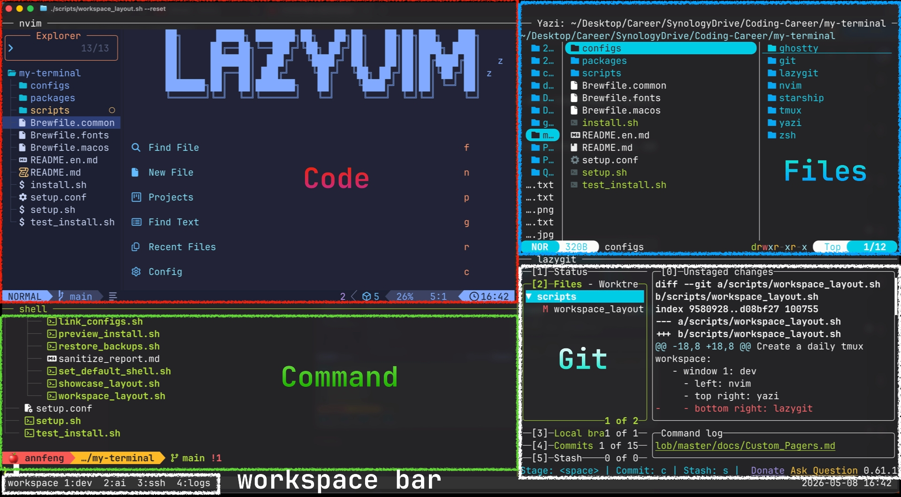

# 🚀 my-terminal

[](https://github.com/AnnFengDeYe/my-terminal/actions/workflows/ci.yml)


[English](README.en.md) | [中文](README.md)

**Cross-platform · Out-of-the-box · Reproducible Terminal Starter Kit.**

While there is no shortage of excellent terminal tools, seamlessly integrating them into a work environment that aligns with intuitive human-computer interaction often requires spending significant time resolving compatibility and dependency issues. This project shares a configuration setup based on my personal workflow habits and visual aesthetics. It resolves the common friction and conflicts among plugins, allowing you to quickly replicate a smooth, out-of-the-box terminal workflow.

It supports macOS, Debian, Ubuntu, Raspberry Pi OS, Arch Linux, and Fedora. The repository manages CLI tools, terminal fonts, and dotfile symlinks. The default entrypoint does not write to the system directly; all real writes require explicit confirmation, and existing configs are backed up before replacement.

## 🖼️ Workspace Preview



`workspace_layout.sh` creates a long-lived tmux workspace designed for daily use:

- The bottom **tmux workspace bar** switches between contexts with `1:dev`, `2:ai`, `3:ssh`, `4:logs`, `5:btop`, and `6:manual`.
- **`1:dev`**: the main development workspace with `Code` / `Command` / `Files` / `Git` panes.
- **`2:ai`**: AI assistant workspace split into `agent-1` / `agent-2`, ready for separate Codex CLI sessions when needed.
- **`3:ssh`**: remote session workspace with a 4-pane `ssh-1` to `ssh-4` grid for multiple devices.
- **`4:logs`**: tests, logs, and watch commands split into `logs-1` / `logs-2`.
- **`5:btop`**: a dedicated system monitor page running `btop` by default.
- **`6:manual`**: an alias and function manual for quickly looking up common `zshrc` commands.

The `manual` data lives in `configs/zsh/workplace_manual.tsv`; edit that table when adding or changing aliases.

Start a workspace for the current directory:

```sh
./scripts/workspace_layout.sh --reset
```

If the zsh config from this repository is loaded, use the shortcut command:

```sh
workplace
```

`workplace` starts or enters the daily workspace for the current directory. Use `workplace --reset` when you want to recreate the session.

On startup, it detects the current terminal size and fits the tmux workspace to the full terminal window. When entering an existing workspace, it also reapplies the workspace layouts so old dimensions do not leave blank padding. Set `WORKSPACE_COLS` / `WORKSPACE_LINES` when you need a fixed size.

Start a workspace for another project:

```sh
./scripts/workspace_layout.sh --dir ~/your-project --reset
```

## ✨ Key Features

- **🌍 Cross-platform install**: detects the OS and uses the matching package manager: Homebrew, apt, pacman, or dnf. Linux can also use Homebrew when explicitly selected.
- **🛡️ Safety first**: preview mode is read-only. It does not create files, install packages, or create symlinks. Real writes require `--yes`, and replacing existing configs requires `--backup`.
- **🧩 Restorable configs**: existing configs are backed up next to the original target, for example `~/.zshrc.backup.20260507-160000`.
- **🧪 Automated tests**: GitHub Actions runs Bash syntax checks, ShellCheck, temporary-HOME safety tests, and tmux workspace / showcase smoke tests.
- **🎭 Privacy sanitization**: existing local configs can be imported into repository copies, with sensitive data sanitized only inside the repository.

## ⚡ Quick Start

Enter the repository and start the interactive menu:

```sh
./setup.sh
```

Recommended first run:

1. Select `1) Preview install` to inspect the OS, tools, fonts, and config link status.
2. Select `2) Start install` after reviewing the preview.
3. Type uppercase `YES` when prompted.
4. Reopen your terminal, or reconnect over SSH.

The menu defaults to Chinese. To use English:

```sh
./setup.sh --lang en
```

The default language can be changed in [setup.conf](./setup.conf).

## 🧭 Menu Actions

| Option | Action | Writes to system |
| --- | --- | --- |
| `1) Preview install` | Shows OS, package manager, tool, font, and config link status | No |
| `2) Start install` | Installs CLI tools, installs Nerd Font, links configs, and sets zsh as the default shell | Yes, requires `YES` |
| `3) Check configuration` | Runs `doctor.sh` to check tools and symlink status | No |
| `4) Restore backups` | Removes repository-managed symlinks and restores the latest backups | Yes, requires `YES` |
| `5) Advanced options` | Link-only setup, optional GUI apps, local config import, and command reference | Depends on selected action |
| `l) Switch language` | Switches between Chinese and English menus | No |
| `0) Exit` | Exits the installer | No |

## 🧰 Included Tools

This repository can automatically install and configure these tools:

**💻 Core CLI / TUI**

- **Shell and prompt**: `zsh`, `zsh-syntax-highlighting`, `starship`
- **CLI enhancements**: `eza`, `bat` / `batcat`, `zoxide`, `ripgrep`, `fd` / `fdfind`, `fzf`
- **System monitor**: `btop`
- **Terminal and file workflow**: `tmux`, `yazi`
- **Developer tools**: `neovim` / `nvim`, `lazygit`

**🖥️ Optional GUI app**

- **Ghostty**: installed only through advanced options or `--install-gui-apps`. macOS uses the larger window profile; Linux / Raspberry Pi OS uses the smaller `70 x 20` profile.

**🔤 Font**

- **JetBrainsMono Nerd Font**: installed into the user font directory and applied where possible to Ghostty, Kitty, Alacritty, LXTerminal, Foot, and similar terminals.

## 🌍 Supported Platforms

| Platform | Default package manager |
| --- | --- |
| macOS | Homebrew |
| Debian | apt |
| Ubuntu | apt |
| Raspberry Pi OS | apt |
| Arch Linux | pacman |
| Fedora | dnf |

Optional Homebrew on Linux:

```sh
./install.sh --install-packages --package-manager brew --backup --yes
```

The scripts do not automatically install Homebrew, rustup, third-party apt sources, PPAs, COPR repositories, or run `curl | bash`.

## 🔗 Config Links

During install, configs under `configs/` are symlinked into the target HOME. Existing targets are never overwritten directly; they are backed up first.

| Repository source | Target path |
| --- | --- |
| `configs/zsh/zshrc` | `~/.zshrc` |
| `configs/zsh/zprofile` | `~/.zprofile` |
| `configs/zsh/zshenv` | `~/.zshenv` |
| `configs/tmux/tmux.conf` | `~/.tmux.conf` |
| `configs/starship/starship.toml` | `~/.config/starship.toml` |
| `configs/ghostty/config` | macOS: `~/.config/ghostty/config` |
| `configs/ghostty/config.linux` | Linux / Raspberry Pi OS: `~/.config/ghostty/config` |
| `configs/yazi/` | `~/.config/yazi` |
| `configs/lazygit/config.yml` | `~/.config/lazygit/config.yml` |
| `configs/nvim/` | `~/.config/nvim` |
| `configs/git/gitconfig` | `~/.gitconfig` |

## 🛠️ Command Reference

| Goal | Command |
| --- | --- |
| Open interactive menu | `./setup.sh` |
| English menu | `./setup.sh --lang en` |
| Safe preview | `./install.sh --dry-run` |
| Recommended install | `./install.sh --install-packages --install-fonts --set-default-shell --backup --yes` |
| Recommended install with Ghostty | `./install.sh --install-packages --install-gui-apps --install-fonts --set-default-shell --backup --yes` |
| Link configs only | `./install.sh --link-only --backup --yes` |
| Check configuration | `./scripts/doctor.sh` |
| Quickly enter daily workspace | `workplace` |
| Recreate daily workspace | `workplace --reset` or `./scripts/workspace_layout.sh --reset` |
| Open README showcase layout | `./scripts/showcase_layout.sh --reset` |
| Preview restore | `./scripts/restore_backups.sh --dry-run` |
| Run restore | `./scripts/restore_backups.sh --yes` |
| Preview local config import | `./scripts/import_existing_configs.sh --dry-run` |
| Import local configs with sanitization | `./scripts/import_existing_configs.sh --yes --sanitize` |
| Run safety tests | `./test_install.sh` |

## 🔁 Restore and Import

Restore only touches symlinks managed by this repository. It does not delete normal files.

```sh
./scripts/restore_backups.sh --dry-run
./scripts/restore_backups.sh --yes
```

Import only copies from the current HOME into repository `configs/`. It never writes back to the real source configs.

```sh
./scripts/import_existing_configs.sh --dry-run
./scripts/import_existing_configs.sh --yes --sanitize
```

The sanitization report is written to [scripts/sanitize_report.md](./scripts/sanitize_report.md).

## 📂 Repository Layout

```text
.
├── setup.sh               # interactive entrypoint
├── install.sh             # core install script
├── test_install.sh        # temporary-HOME safety tests
├── LICENSE                # MIT License
├── assets/                # README images and showcase assets
├── configs/               # dotfiles to link
├── packages/              # platform package lists
├── scripts/               # doctor, restore, import, and maintenance scripts
├── Brewfile.common        # common Homebrew CLI dependencies
├── Brewfile.fonts         # Homebrew font dependencies
└── Brewfile.macos         # macOS-only dependencies
```

## 📄 License

This project is licensed under the [MIT License](./LICENSE).
