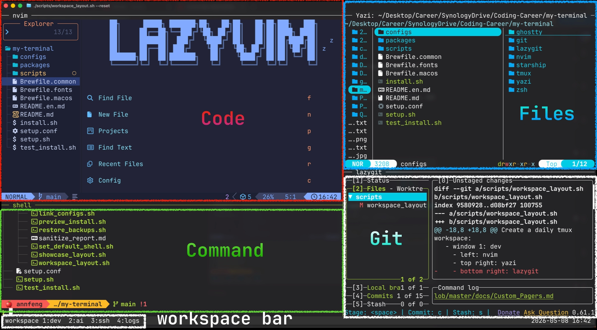

# 🚀 my-terminal

[](https://github.com/AnnFengDeYe/my-terminal/actions/workflows/ci.yml)


[中文](README.md) | [English](README.en.md)

**跨平台 · 开箱即用 · 可复现的 Terminal Starter Kit。**

优秀的终端工具数不胜数，但将它们无缝集成，打造出符合人机交互直觉的工作环境，往往需要耗费大量时间解决兼容与依赖问题。本项目分享了一套基于我个人操作习惯与视觉审美的配置方案。它处理了常见插件间的协同摩擦，快速还原一套顺手、开箱即用的终端工作流。

支持 macOS、Debian、Ubuntu、Raspberry Pi OS、Arch Linux 和 Fedora。仓库统一管理 CLI 工具、终端字体和 dotfiles 软链接；默认入口不会直接写入系统，所有真实写入操作都需要显式确认，并会在覆盖前备份原配置。

## 🖼️ Workspace 预览



`workspace_layout.sh` 会创建一个面向日常使用的长期 tmux 工作区：

- 底部 **tmux workspace bar** 使用 `1:dev`、`2:agent`、`3:ssh`、`4:logs`、`5:btop`、`6:manual` 在不同工作上下文之间切换。
- **`1:dev`**：主开发工作区，包含 `Code` / `Command` / `Git` / `Files` 四个 pane。
- **`2:agent`**：AI 辅助工作区，默认左右二分为 `Codex` / `Gemini`。如果本机已安装对应 CLI，会自动进入；未安装时保持普通 shell。
- **`3:ssh`**：远程连接工作区，默认四宫格 `ssh-1` 到 `ssh-4`，方便同时连接多个设备。
- **`4:logs`**：测试、日志和 watch 命令工作区，默认左右二分为 `logs-1` / `logs-2`。
- **`5:btop`**：单独的系统监控页面，默认运行 `btop`。
- **`6:manual`**：别名和函数说明书，可快速查询 `zshrc` 中常用命令的用途。

`manual` 的说明数据来自 `configs/zsh/workplace_manual.tsv`；新增或调整别名后，可直接编辑这个表格补充说明，再用 `./scripts/workplace_manual.sh --check` 确认手册与 `zshrc` 一致（行号漂移可用 `--sync` 自动修正）。

启动当前目录的工作区：

```sh
./scripts/workspace_layout.sh
```

如果已通过本仓库加载 zsh 配置，可以直接使用快速命令：

```sh
workplace
```

为其他项目启动工作区：

```sh
./scripts/workspace_layout.sh --dir ~/your-project
```

启动时会自动检测当前终端尺寸并让 tmux workspace 铺满整个终端窗口；进入已有 workspace 时只同步窗口尺寸，保留当前 pane 比例和 zoom 状态，避免局部放大被恢复成默认布局。需要固定尺寸时可设置 `WORKSPACE_COLS` / `WORKSPACE_LINES`。

### 🗂️ 每个项目一个 workspace

`workplace` 默认进入全局唯一的日常 workspace。加上 `--project`（别名 `wp`）后，每个项目拥有自己的 workspace。“项目”指目录所在的 git 仓库，不在仓库内时就是目录本身，所以在仓库的任意子目录运行、或用 `--dir` 指向任意子目录，都会回到同一个 workspace。日常 workspace 和用 `--session` 命名的 workspace 即使在同一目录启动，也不会被当作该目录的项目 workspace。

| 命令 | 作用 |
| --- | --- |
| `wp` / `workplace --project` | 进入当前项目的 workspace，不存在则创建 |
| `wpick` / `workplace --pick` | 选择正在运行的 workspace，或选一个项目目录新建；在 tmux 内按 `Alt+0` 会弹出同一个选择器 |
| `wls` / `workplace --sessions` | 列出正在运行的 workspace、类型（`daily` / `project` / `named`）和目录 |

- 选择器的候选目录来自 zoxide 的访问记录，也可以用 `WORKSPACE_PICK_DIRS=~/projects:~/work` 指定父目录。装有 fzf 时带预览，否则退化为编号菜单。
- 想让 `workplace` 默认按项目划分，设置 `WORKSPACE_SESSION_MODE=project`；此时用 `workplace --global` 进入日常 workspace。
- 状态栏左侧显示当前 workspace 的名字，当前窗口高亮；其他窗口响铃时标记 `!`。
- `Alt+0` 可用 `WORKSPACE_PICK_KEY` 改成别的按键，设为 `none` 则取消绑定。按键属于整个 tmux server，设置一次后会被记住。
- 用选择器切换到正在运行的 workspace 时，不会改动它当前的窗口和输入内容。
- 如果系统里已有名为 `wp` 的命令（例如 WP-CLI），别名 `wp` 不会定义，请直接使用 `workplace --project`。

### 🤖 Agent 窗口

Agent 默认配置来自 `configs/workspace/agents.tsv`。仓库不会自动安装 Codex、Gemini 或其他 AI CLI；每个 pane 启动时只检测配置里的命令是否存在，存在才进入对应 CLI，不存在就提示并回到 shell。需要自定义时，可设置 `WORKSPACE_AGENT_CONFIG=/path/to/agents.tsv`，创建 `~/.config/my-terminal/workspace_agents.tsv`，或在项目内创建 `.my-terminal/agents.tsv`，格式如下：

```tsv
# role	title	command	cwd
agent-1	Codex	codex	worktree
agent-2	Gemini	gemini	worktree
agent-3	Claude	claude
```

各列用 Tab 分隔，可以用多个 Tab 对齐；因此空列要写成 `-`，例如命令列写 `-` 表示只开一个 shell。第 4 列 `cwd` 可省略，表示 agent 在哪个目录启动：省略是 workspace 目录，`worktree` 是该 agent 专属的 git worktree，也可以写路径（相对 workspace 目录，或以 `/`、`~/` 开头）。Agent 进程能读到 `WORKSPACE_ROOT`、`WORKSPACE_AGENT_ROLE`、`WORKSPACE_AGENT_TITLE` 三个环境变量。

`WORKSPACE_AGENT_CONFIG`、`--agent-worktrees` 这类设置会跟着它们创建的 workspace 保存：再次进入或 `--repair` 时沿用，不需要重复指定。它们不会传给 workspace 里的 shell，所以在里面输入的命令只看你自己的环境，不会把这个 workspace 的设置带到别的 workspace。

**项目内配置需要先信任。** `.my-terminal/agents.tsv` 里的命令会在打开 workspace 时自动运行，所以刚克隆下来的仓库不能直接生效：未信任的项目配置会被忽略并给出提示，改用上一级的默认配置。检查文件内容后运行一次 `workplace --trust` 即可；文件内容一旦改动，需要重新信任。

**让多个 agent 并行改代码。** 多个 agent 共用一个工作目录时会互相覆盖改动。`worktree` 让每个 agent 在自己的 git worktree 和分支（`agent/<role>`）里工作，你的工作目录保持不变：

```sh
workplace --project --agent-worktrees   # 本次所有 agent 都使用 worktree
workplace --worktrees                   # 查看各 worktree 的分支与状态
git merge agent/agent-1                 # 在自己的工作目录里合并 agent 的成果
workplace --prune-worktrees             # 预览可清理的 worktree
workplace --prune-worktrees --yes       # 执行清理
```

worktree 创建在仓库之外（`~/.local/share/my-terminal/worktrees/`，可用 `WORKSPACE_WORKTREE_ROOT` 修改），编辑器、搜索工具和语言服务器不会看到第二份代码。清理只会移除“不会丢东西”的 worktree：有未提交改动、有尚未合并的提交、或仍有 pane 在里面运行的都会保留。

**同一个问题问所有 agent。** `wsend`（即 `workplace --send`）把一段文字粘贴到所有正在运行的 agent 并回车，方便对比回答：

```sh
wsend "review the staged diff and list risky changes"
wsend "只回答这一条" --to Claude          # 按 role 或标题筛选，逗号分隔
git diff --staged | wsend -               # 从标准输入读取
wsend "先别提交" --no-enter               # 只粘贴，不回车
```

只有正在运行 agent 的 pane 会收到文字：要么 agent 是 workspace 启动的且仍在运行，要么前台程序就是配置里的那个 agent。停在 shell 提示符、ssh 或 REPL 的 pane 会被跳过，所以提示词里的反引号或 `$(...)` 不会被 shell 执行。agent 退出后手动重新启动的 Node 类 CLI 以 `node` 进程运行，不会被识别；这种情况请留意跳过提示。

**知道 agent 何时需要你。** agent 响铃时，状态栏里的 `2:agent` 会标记 `!` 并变色。如果所用的 CLI 不会响铃，可在 shell 配置里 `export WORKSPACE_AGENT_SILENCE=30`：agent 窗口安静 30 秒后标记 `~`，终端同时响铃一次。

### 🔧 修复与重建

`workplace` 会启动或进入 workspace。进入已有 workspace 时会做轻量、非破坏性 repair：恢复被管理窗口的名称、顺序、tmux hooks 和 options，不会删除未知窗口，也不会终止正在运行的任务。

如果某个被管理 pane 被关闭，或 pane title / role 被改乱，可运行 `workplace --repair` 补回缺失的 managed pane 并修复 pane metadata；它不会删除已有 pane 或未知窗口。需要连 managed pane 布局一起重新整理时使用 `workplace --repair-layout`。`workplace --reset` 会删除并重建整个 tmux session，会终止里面正在运行的任务。

`--reset` 按这一次命令给出的设置重建，不沿用原来的：想保留自定义 agent 配置或 worktree，需要在 reset 时再写一次；不写就回到默认。

在 workspace 里面运行这些命令时，作用对象就是你所在的这个 workspace；命令里用 `--session`、`--project`、`--global` 或 `--dir` 指明了别的目标时，以命令为准。在里面运行 `workplace --reset` 会先建好新的 workspace、把终端切换过去，再移除旧的，不会把你踢出 tmux，并且仍在这个 workspace 原来的目录重建；在外面运行则在当前目录重建。

pane 边框上的名称由 workspace 保存，不会被程序通过转义序列改写的终端标题覆盖。

## ✨ 核心特性

- **🌍 跨平台安装**：自动识别系统并调用对应包管理器：Homebrew、apt、pacman 或 dnf。Linux 也可以手动指定 Homebrew。
- **🛡️ 安全优先**：预览模式只读，不创建文件、不安装软件、不创建软链接。真实写入必须带 `--yes`，覆盖已有配置必须带 `--backup`。
- **🧩 可恢复配置**：原有配置会备份到同目录，例如 `~/.zshrc.backup.20260507-160000`。
- **🧪 自动化测试**：GitHub Actions 在 Ubuntu 和 macOS 上运行 Bash / zsh 语法检查、ShellCheck、临时 HOME 安全测试，以及 tmux workspace 测试。两套测试都可以在本地运行，不会碰你的配置和 tmux 会话。
- **🤖 面向多 agent 的 workspace**：每个项目一个 workspace，agent 可在各自的 git worktree 里并行工作，一条命令向所有 agent 提问；项目内的 agent 配置必须先信任才会运行。
- **🎭 隐私脱敏**：可将当前本机配置导入仓库副本，并只在仓库内执行敏感信息脱敏。

## ⚡ 快速开始

进入仓库目录，运行交互式菜单：

```sh
./setup.sh
```

首次使用建议流程：

1. 选择 `1) 预览安装`，检查系统、工具、字体和配置链接状态。
2. 确认无误后选择 `2) 开始安装`。
3. 按提示输入大写 `YES`。
4. 安装完成后重新打开终端，或重新 SSH 登录。

菜单默认中文。英文界面：

```sh
./setup.sh --lang en
```

默认语言可在 [setup.conf](./setup.conf) 中修改。

## 🧭 菜单功能

| 选项 | 功能 | 是否写入系统 |
| --- | --- | --- |
| `1) 预览安装` | 显示系统、包管理器、工具、字体和配置链接状态 | 否 |
| `2) 开始安装` | 安装 CLI 工具、安装 Nerd Font、链接配置，并切换默认 shell 为 zsh | 是，需输入 `YES` |
| `3) 检查配置` | 运行 `doctor.sh` 检查工具和软链接状态 | 否 |
| `4) 恢复备份` | 删除本仓库管理的软链接，并恢复最近备份 | 是，需输入 `YES` |
| `5) 高级选项` | 只链接配置、包含 GUI 应用、导入本机配置、查看命令 | 按所选操作决定 |
| `l) 切换语言` | 在中文和英文菜单间切换 | 否 |
| `0) 退出` | 退出安装器 | 否 |

## 🧰 包含工具

本仓库可自动安装并配置以下工具：

**💻 核心 CLI / TUI**

- **Shell 与提示符**：`zsh`、`zsh-syntax-highlighting`、`starship`
- **命令行增强**：`eza`、`bat` / `batcat`、`zoxide`、`ripgrep`、`fd` / `fdfind`、`fzf`。Debian、Ubuntu 和 Raspberry Pi OS 把 `bat`、`fd` 安装成 `batcat`、`fdfind`，安装时会在 `~/.local/bin` 创建 `bat`、`fd` 链接，别名、fzf 预览、Yazi 和 LazyVim 才能找到它们。
- **系统监控**：`btop`
- **终端与文件工作流**：`tmux`、`yazi`
- **开发工具**：`neovim` / `nvim`、`lazygit`

**🖥️ 可选 GUI 应用**

- **Ghostty**：需通过高级选项或 `--install-gui-apps` 安装。macOS 使用较大窗口配置；Linux / Raspberry Pi OS 使用 `70 x 20` 小窗口配置。

**🔤 字体**

- **JetBrainsMono Nerd Font**：安装到用户字体目录，并尽量应用到 Ghostty、Kitty、Alacritty、LXTerminal、Foot 等终端。

## 🌍 支持平台

| 平台 | 默认包管理器 |
| --- | --- |
| macOS | Homebrew |
| Debian | apt |
| Ubuntu | apt |
| Raspberry Pi OS | apt |
| Arch Linux | pacman |
| Fedora | dnf |

Linux 可选 Homebrew：

```sh
./install.sh --install-packages --package-manager brew --backup --yes
```

脚本不会自动安装 Homebrew、rustup、第三方 apt 源、PPA、COPR，也不会执行 `curl | bash`。

## 🔗 配置映射关系

执行安装时，会把 `configs/` 下的配置软链接到目标 HOME。已有目标不会被直接覆盖，会先备份再链接。

| 仓库源文件 | 目标路径 |
| --- | --- |
| `configs/zsh/zshrc` | `~/.zshrc` |
| `configs/zsh/zprofile` | `~/.zprofile` |
| `configs/zsh/zshenv` | `~/.zshenv` |
| `configs/tmux/tmux.conf` | `~/.tmux.conf` |
| `configs/starship/starship.toml` | `~/.config/starship.toml` |
| `configs/ghostty/config` | macOS: `~/.config/ghostty/config` |
| `configs/ghostty/config.linux` | Linux / Raspberry Pi OS: `~/.config/ghostty/config` |
| `configs/yazi/` | `~/.config/yazi` |
| `configs/lazygit/config.yml` | `~/.config/lazygit/config.yml` |
| `configs/nvim/` | `~/.config/nvim` |
| `configs/git/gitconfig` | `~/.gitconfig` |

`configs/git/gitconfig` 只包含通用默认值，不含任何身份信息，并在末尾 include `~/.gitconfig.local`。链接时如果你已有 `~/.gitconfig`，它会先被复制为 `~/.gitconfig.local`（已存在则不覆盖），姓名、邮箱、签名和凭据设置因此继续生效。个人设置请写入 `~/.gitconfig.local`，例如 `git config --file ~/.gitconfig.local user.name "Your Name"`；`git config --global` 会顺着软链接改到仓库文件。

## 🛠️ 常用命令速查

| 目标操作 | 命令 |
| --- | --- |
| 打开交互菜单 | `./setup.sh` |
| 英文菜单 | `./setup.sh --lang en` |
| 安全预览 | `./install.sh --dry-run` |
| 推荐安装 | `./install.sh --install-packages --install-fonts --set-default-shell --backup --yes` |
| 推荐安装，包含 Ghostty | `./install.sh --install-packages --install-gui-apps --install-fonts --set-default-shell --backup --yes` |
| 只链接配置 | `./install.sh --link-only --backup --yes` |
| 检查配置 | `./scripts/doctor.sh` |
| 检查别名手册是否与 zshrc 一致 | `./scripts/workplace_manual.sh --check`，修正行号用 `--sync` |
| 为 `batcat` / `fdfind` 创建 `bat` / `fd` 链接 | `./scripts/install_command_shims.sh --yes` |
| 快速进入日常 workspace | `workplace` |
| 进入当前项目的 workspace | `wp` 或 `workplace --project` |
| 选择 / 新建项目 workspace | `wpick` 或 `workplace --pick`，tmux 内按 `Alt+0` |
| 列出正在运行的 workspace | `wls` 或 `workplace --sessions` |
| 向所有 agent 发送同一条提示词 | `wsend "..."` 或 `workplace --send "..."` |
| agent 使用独立 worktree | `workplace --project --agent-worktrees` |
| 查看 / 清理 agent worktree | `workplace --worktrees`、`workplace --prune-worktrees [--yes]` |
| 信任项目内的 agent 配置 | `workplace --trust` |
| 非破坏性修复 workspace | `workplace --repair` 或 `./scripts/workspace_layout.sh --repair` |
| 重建 workspace | `workplace --reset` 或 `./scripts/workspace_layout.sh --reset` |
| 打开 README 展示布局 | `./scripts/showcase_layout.sh --reset` |
| 预览恢复 | `./scripts/restore_backups.sh --dry-run` |
| 执行恢复 | `./scripts/restore_backups.sh --yes` |
| 预览导入本机配置 | `./scripts/import_existing_configs.sh --dry-run` |
| 导入本机配置并脱敏 | `./scripts/import_existing_configs.sh --yes --sanitize` |
| 运行安装安全测试 | `./test_install.sh` |
| 运行 workspace 测试 | `./test_workspace.sh` |

## 🔁 恢复与导入

恢复只处理“指向本仓库的软链接”，不会删除普通文件。安装时生成的 `~/.gitconfig.local` 和 `~/.local/bin` 下的 `bat` / `fd` 链接会保留，不需要时可手动删除。

```sh
./scripts/restore_backups.sh --dry-run
./scripts/restore_backups.sh --yes
```

导入只从当前 HOME 复制到仓库 `configs/`，不会反向写回真实配置。

```sh
./scripts/import_existing_configs.sh --dry-run
./scripts/import_existing_configs.sh --yes --sanitize
```

脱敏报告写入 [scripts/sanitize_report.md](./scripts/sanitize_report.md)。

## 📂 目录结构

```text
.
├── setup.sh               # 交互式主入口
├── install.sh             # 核心安装脚本
├── test_install.sh        # 临时 HOME 安全测试
├── test_workspace.sh      # 隔离 tmux server 上的 workspace 测试
├── LICENSE                # MIT License
├── assets/                # README 图片和展示资源
├── configs/               # 待链接的 dotfiles
├── packages/              # 平台包列表
├── scripts/               # doctor、restore、import 等维护脚本
├── Brewfile.common        # Homebrew 通用 CLI 依赖
└── Brewfile.fonts         # Homebrew 字体依赖
```

## 📄 License

本项目使用 [MIT License](./LICENSE)。
